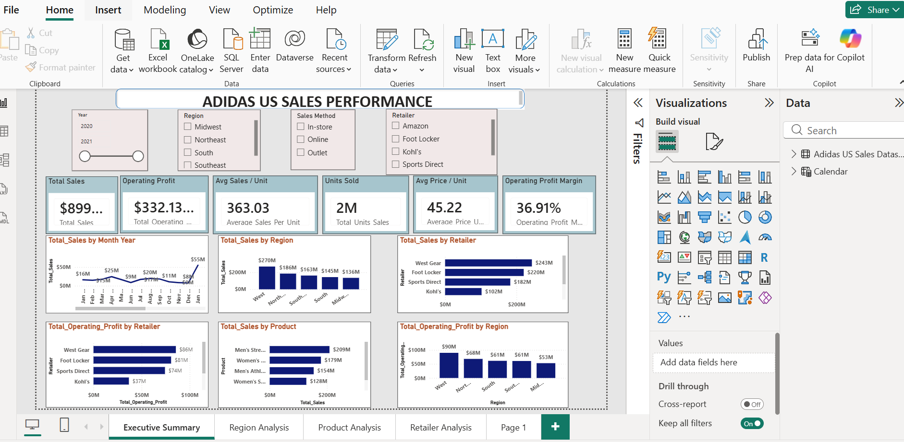
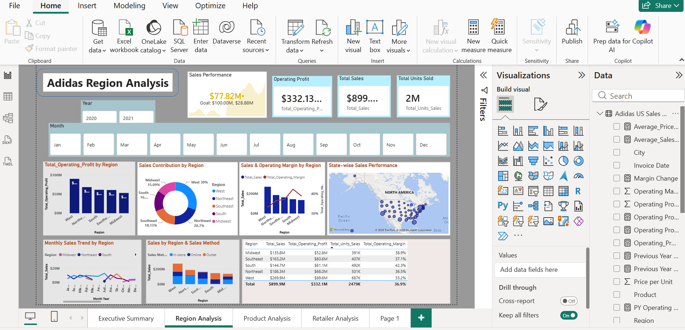
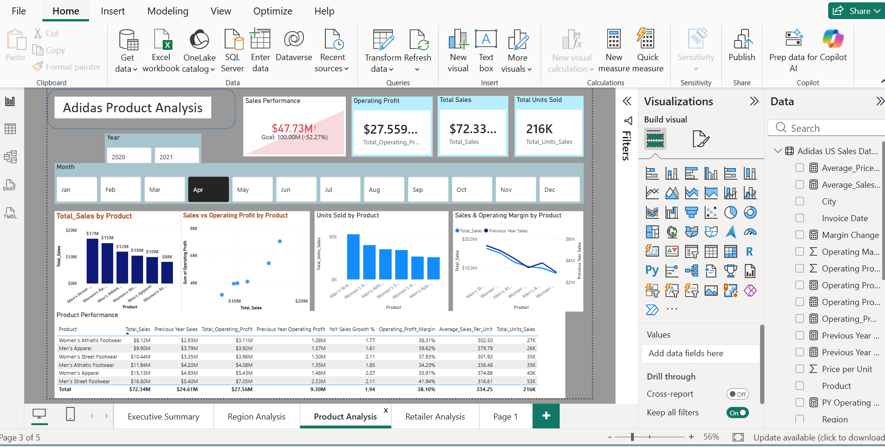
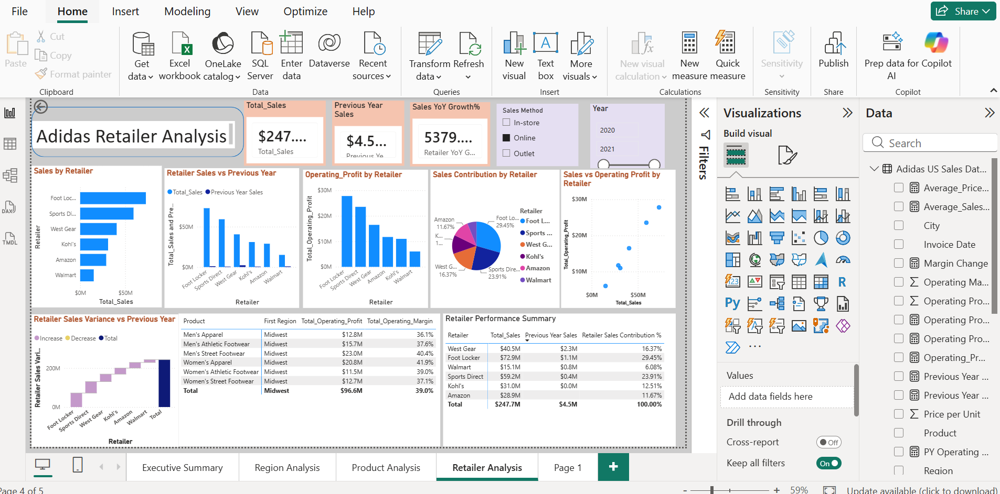

# Adidas US Sales Analysis – Power BI

## 📊 Project Overview

This project analyzes Adidas US sales performance using Microsoft Power BI.

The dashboard provides a management-level view of sales, profitability, regional performance, retailer performance, product performance, and sales methods.

The objective is to convert raw sales data into meaningful business insights and actionable recommendations.

---

## 🎯 Business Objectives

- Analyze overall sales and profitability
- Identify high-performing regions and states
- Evaluate retailer performance
- Analyze product-wise sales and profitability
- Compare different sales methods
- Analyze sales trends over time
- Compare current-year and previous-year performance
- Identify business growth opportunities
- Provide data-driven recommendations

---

## 🛠️ Tools & Technologies

- Power BI
- Power Query
- DAX
- Excel
- CSV

---

## 📂 Dataset

The analysis uses the Adidas US Sales dataset.

### Key fields include:

- Retailer
- Invoice Date
- Region
- State
- City
- Product
- Price per Unit
- Units Sold
- Total Sales
- Operating Profit
- Operating Margin
- Sales Method

---

## 🧹 Data Preparation

Data preparation and transformation were performed using Power Query.

### Key activities:

- Checked missing values
- Checked duplicate records
- Corrected data types
- Standardized data values
- Validated date fields
- Validated numerical fields
- Prepared data for Power BI analysis

---

## 📐 DAX & KPI Analysis

DAX (Data Analysis Expressions) was used to build the calculation layer of the dashboard and derive key numerical statistics and business performance metrics.

The DAX measures include **Total Sales, Total Units Sold, Total Operating Profit, Operating Profit Margin, Average Price per Unit, Average Sales per Unit, Previous Year Sales, and Sales Growth %**, supported by time-intelligence calculations for year-over-year and period-based analysis.

These measures are used across the dashboard to drive **KPI cards, trend analysis, regional comparisons, product and retailer analysis, profitability analysis, and performance comparisons**.

📌 **For the complete DAX formulas, data model, relationships, measures, and their implementation, please refer to:**  
**`Adidas_US_Sales_Dashboard_RP.pbix`**

### Key KPIs

- Total Sales
- Total Units Sold
- Total Operating Profit
- Operating Margin
- Previous Year Sales
- Sales Growth
- Profit Growth
- Average Selling Price

These measures were used to create interactive visuals and management-level KPIs.

---

# 📊 Dashboard Analysis

## 1. Executive Summary

The Executive Summary provides a high-level overview of Adidas US sales performance.

It includes:

- Total Sales
- Total Units Sold
- Operating Profit
- Operating Margin
- Sales Trends
- Regional Performance
- Sales Method Analysis
- Year-over-Year Performance

### Dashboard Preview



---

## 2. Regional Analysis

The Regional Analysis page evaluates sales and profitability across different regions and states.

It helps identify:

- High-performing regions
- Low-performing regions
- Regional sales contribution
- Regional profitability
- Growth opportunities

### Dashboard Preview



---

## 3. Product Analysis

The Product Analysis page evaluates product-level performance.

It focuses on:

- Product-wise Sales
- Units Sold
- Operating Profit
- Product contribution
- High-performing products
- Underperforming products

### Dashboard Preview



---

## 4. Retailer Analysis

The Retailer Analysis page compares Adidas retailer performance.

It helps identify:

- Top-performing retailers
- Retailer sales contribution
- Retailer profitability
- Units sold
- Opportunities to improve retailer performance

### Dashboard Preview



---

# 💡 Business Insights

The analysis helps management understand:

- Which regions contribute significantly to overall sales
- Which retailers generate the highest sales
- Which products perform strongly
- Which sales methods contribute most to revenue
- How sales performance changes over time
- How current performance compares with previous-year performance
- Where sales and profitability can be improved

---

# 🚀 Business Recommendations

Based on the analysis, the following actions can be considered:

1. Strengthen high-performing regions through focused sales and marketing initiatives.

2. Improve the performance of underperforming regions by identifying local market opportunities.

3. Maintain strong relationships with high-performing retailers.

4. Develop targeted strategies for retailers with lower sales contribution.

5. Focus on products with strong sales and profitability.

6. Review underperforming products and evaluate pricing, promotions, and customer demand.

7. Optimize sales methods based on their contribution to revenue and profitability.

8. Use historical and seasonal sales trends for inventory and promotional planning.

9. Monitor year-over-year performance regularly to identify growth opportunities.

---

# 📈 Skills Demonstrated

- Data Cleaning
- Data Transformation
- Power Query
- Data Modeling
- DAX
- KPI Development
- Time Intelligence
- Sales Analysis
- Profitability Analysis
- Regional Analysis
- Retailer Analysis
- Product Analysis
- Dashboard Design
- Business Intelligence
- Data Storytelling
- Business Insights

---

# 📁 Project Structure

```text
Adidas-US-Sales-PowerBI/
│
├── Dataset/
│   ├── Adidas US Sales Datasets.csv
│   └── README.md
│
├── Screenshots/
│   ├── Executive_Summary.png
│   ├── Regional_Analysis.png
│   ├── Product_Analysis.png
│   ├── Retailer_Analysis.png
│   └── README.md
│
├── Adidas_US_Sales_Dashboard_RP.pbix
│
└── README.md
